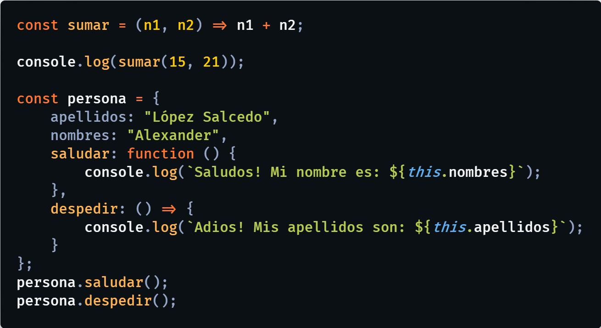
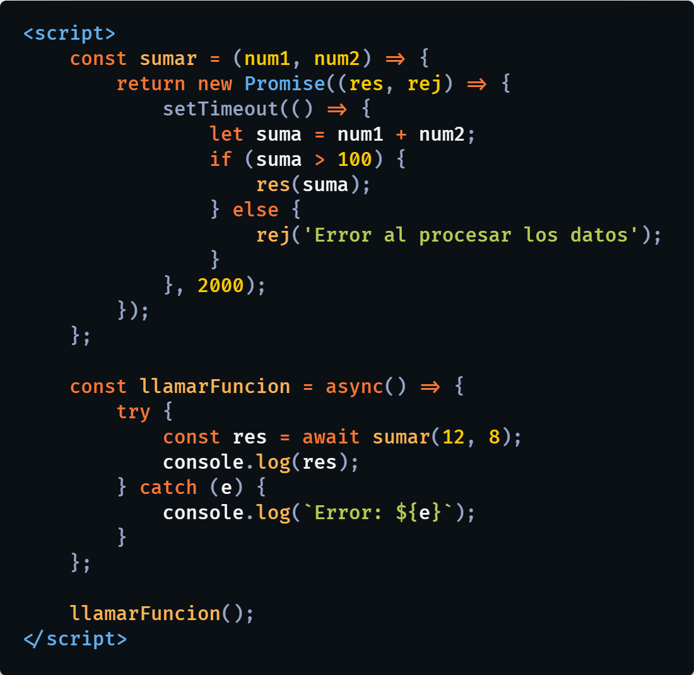
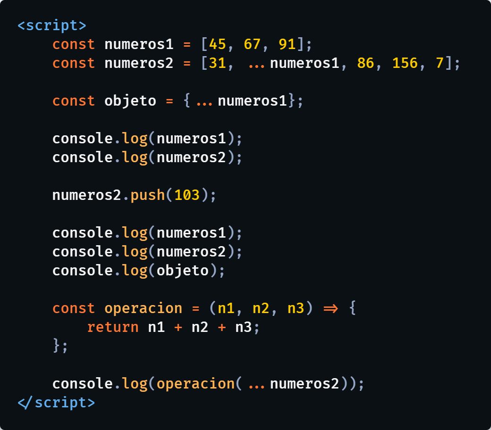

# Curso de JavaScript ([UskoKruM2010](https://youtube.com/UskoKruM2010))
Curso de JavaScript desde 0, creado en YouTube, en el canal:
  

## Todos los videos del curso: [Aquí](https://www.youtube.com/playlist?list=PL_wRgp7nihyYdnV6ilQcZsfdG5d2nGWkc)

 

  

  
